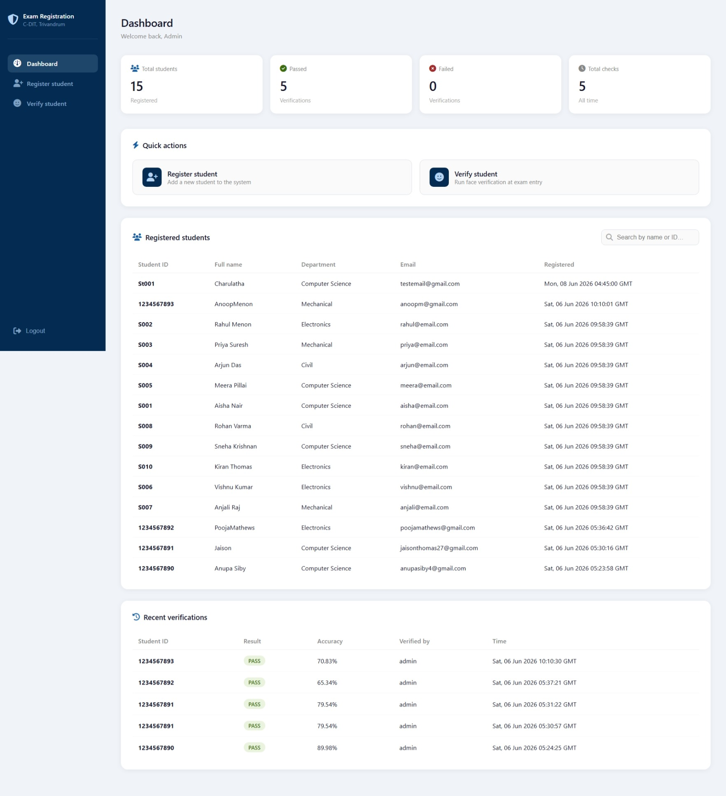
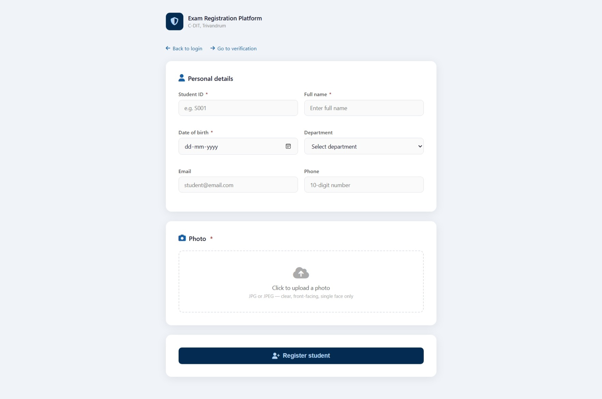
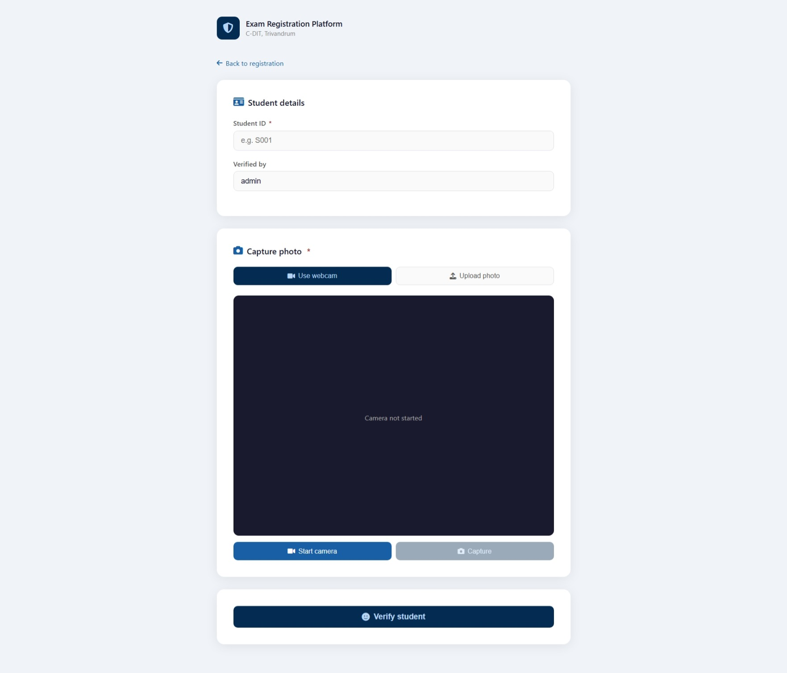

# Exam Registration Platform

> A web-based exam candidate registration and identity verification system built for **C-DIT, Trivandrum**.

---

## Overview

The Exam Registration Platform allows administrators to register exam candidates and verify their identity on exam day using a photo-based lookup system.

**Two core workflows:**
- **Register Student** — Admin adds candidate details and a photo to the system.
- **Verify Student** — Invigilator searches for a candidate on exam day and visually confirms identity using the registered photo.

---

## Screenshots
### Login Page


### Dashboard


### Registration of students


### Verification of students



## Features

- Secure admin login with bcrypt password hashing
- Dashboard with live stats — total registered students, passed/failed verifications, total checks
- Register students with: Student ID, Full Name, Date of Birth, Department, Email, Phone, and Photo
- Search registered students by name or Student ID
- Departments supported: Computer Science, Electronics, Mechanical, Civil
- Student list with registration timestamps

---

## Tech Stack

| Layer     | Technology                      |
|--------------------------------------------|        
| Frontend  | HTML / CSS / JavaScript         |
| Backend   | Python                          |
| Database  | SQLite (`exam_registration.db`) |
| Auth      | bcrypt (password hashing)       |

---

## Prerequisites

- Python 3.9.13
- Flask 3.0
- PostgreSQL 15
- OpenCV 4.11
- NumPy 2.0
- VS Code

## Installation

```bash
# 1. Clone the repository
git clone https://github.com/Niya-Paul07/ImageVerificationDatabase.git
pip install bcrypt

# 3. Create the database tables from schema
python database.py
# Creates exam_registration.db using schema.sql

# 4. Create the default admin account
python create_admin.py
# Default credentials — username: admin | password: admin123
# Change the password after first login!

# 5. Start the app
python app.py
```

Open `http://localhost:5000` in your browser.

---

## Default Admin Credentials

| Username | Password  |
|----------|-----------|
| `admin`  | `admin123` |

> ⚠️ Change the default password before deploying to production.

---

## Usage

### Admin Login
- Navigate to the login page.
- Enter your username and password.
- Access is restricted to authorised personnel only.

### Registering a Student
1. Go to **Register Student** from the sidebar or dashboard quick actions.
2. Fill in: Student ID, Full Name, Date of Birth, Department, Email, Phone.
3. Upload the student's photo.
4. Submit — the student appears in the registered list on the dashboard.

### Verifying a Student on Exam Day
1. Go to **Verify Student** from the sidebar or dashboard quick actions.
2. Search by name or Student ID.
3. The registered photo and details are displayed.
4. The invigilator visually confirms the identity of the candidate.

---

## Project Structure

```
ImageVerificationDatabase/
├── sample_photos/
├── screenshots/             # Main application entry point
├── templates/               # HTML pages
│   ├── login.html
│   ├── dashboard.html
│   ├── register.html
│   └── verify.html
├── .gitignore            
├── app.py                   # Main application file
├── build.sh                 # Deployment build script
├── database.py              # Creates the database from schema.sql
├── schema.sql               # SQL schema — table definitions
├── create_admin.py          # Script to initialise admin account
├── exam_registration.db     # SQLite database (auto-created)
├── insert_sample_data.py    # stores sampledata and inserts into app   
├── requirements.txt         # Lists required Python packages
├── runtime.txt              # Specifies Python-runtime version
├── Procfile                 # Deployment configuration file       
├── static/                  # CSS, JS, images
└── README.md                # Project documentation
```

---

## Database

The app uses a local SQLite database (`exam_registration.db`). No external database setup is needed.

The schema is defined in `schema.sql` and applied by running `database.py`. To reset and recreate everything from scratch:

```bash
# Step 1 — Recreate tables from schema
python database.py

# Step 2 — Recreate admin account
python create_admin.py
```

---

## Known Limitations

- Identity verification is manual (photo comparison) — no automated face recognition.
- No self-registration for students; all entries are admin-managed.
- Single admin account (no multi-user roles yet).
- SQLite is suitable for small-scale use (up to ~150 candidates); switch to PostgreSQL for larger deployments.

---

## License

This project is licensed under the MIT License.

